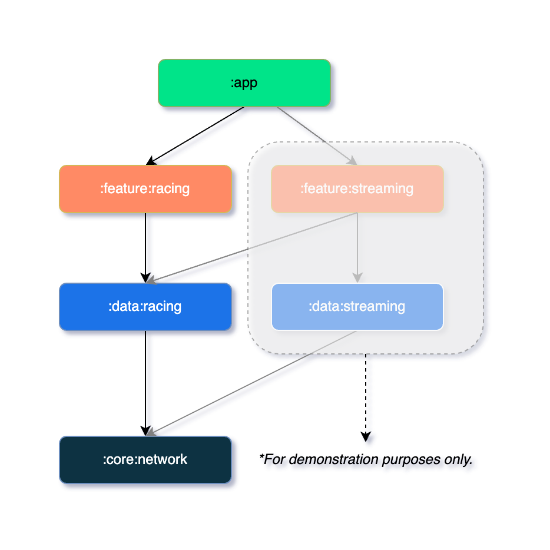

# NextToGo

## Overview
This is a native Android app for a Tech Assessment!

This project demonstrates a simplified version of a betting app, featuring a racing list screen that displays upcoming races.

## Features
- Display upcoming races
- Filter races by categories
- Auto-refresh countdown timers for race start times
- Refresh race data from server
- Auto-refresh race data from server every minute
- Support for Light and Dark Modes
- Handle Loading and Error states

## Build Environment

* **Android Studio**: Android Studio Koala Feature Drop | 2024.1.2
* **JDK**: 17
* **Gradle**: 8.7

## Tech Stack
Main tech stack: Kotlin + Jetpack Compose + Hilt + Modularization + MVVM + Ktor + Mockk + Kotest

### Modularization

The app follows a modularization approach based on the [Guide to Android app modularization](https://developer.android.com/topic/modularization). The diagram below demonstrates the current project module structure.

### Lint

The project uses [Detekt](https://github.com/detekt/detekt) as the static code analysis tool to maintain code consistency and quality. Additionally, extra [Compose-Rules](https://github.com/mrmans0n/compose-rules) is integrated to ensure the Compose UI code adheres to best practices.

Run `./gradlew detekt` to check for code violations.

### Test

The project uses [MockK](https://mockk.io/) for dependency stubbing and [Kotest](https://kotest.io/) as the assertion library. It also incorporates the following libraries to enhance testing capabilities:

- [Turbine](https://github.com/cashapp/turbine) for Kotlin Flow testing.
- [Mock-Client](https://ktor.io/docs/client-testing.html) for Ktor Client testing.
- [Kotlinx-Coroutines-Test](https://kotlinlang.org/api/kotlinx.coroutines/kotlinx-coroutines-test/) for Kotlin Coroutine testing.

### Gradle Build

The project uses [Gradle Version Catalog](https://developer.android.com/build/migrate-to-catalogs) to manage dependencies across multiple modules effectively.

Additionally, it leverages a `build-logic` module to centralize shared build logic, tasks, and plugin configurations. In this project, it is currently used to manage Detekt configurations.

References:
- [NowInAndroid build-logic](https://github.com/android/nowinandroid/tree/main/build-logic)
- [Herding Elephants - Modularization](https://developer.squareup.com/blog/herding-elephants/)

## Pitfalls

- The API to retrieve the next races may be protected and respond with an error if requests are made too frequently. In this case, stop sending requests until the issue is resolved.
- The `content-type` in the API response header is `text/plain`, which prevents Ktor from deserializing the response as JSON. Solution Reference: [Ktor fails to parse JSON for API response because of text/plain content type](https://stackoverflow.com/questions/77164812/ktor-fails-to-parse-json-for-api-response-because-of-text-html-content-type-at).